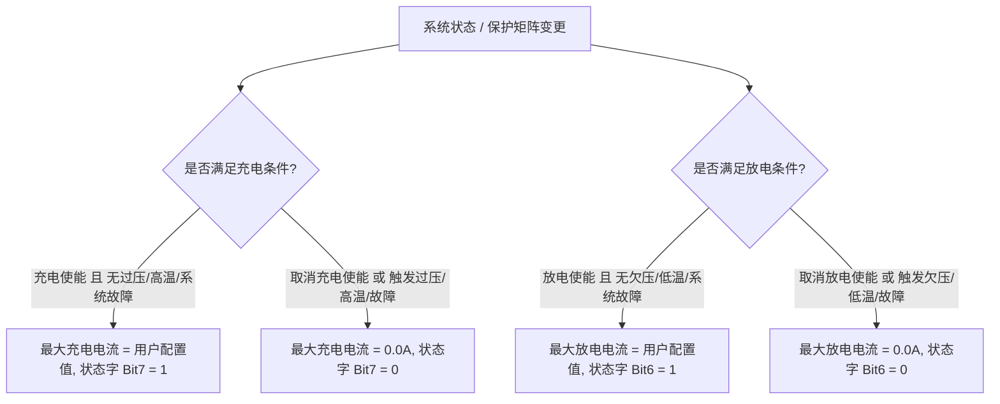

# BMS 多协议仿真与测试工作台 V1.0 (使用说明书)

## 一、 软件概述

**BMS Protocol Simulator** 是专为储能逆变器研发与自动化测试部门打造的单文件便携式测试上位机。无需安装任何 Python 环境或第三方依赖库，双击即可在 Windows 7 / 10 / 11 操作系统上原生稳定运行。

### 核心特性
1. **四大主流协议原生支持（全面适配 3KU 与 6KU）**：
   - **PYLONTECH (RS485 ASCII)**：以官方 Pylon low voltage RS485 规范及 6KU 全特性为基准全面升级：
     - 系统级指令：`60H` (系统基本信息)、`61H` (26项系统模拟量/总压/总流/SOC/SOH/单芯/开尔文温度/循环次数)、`62H` (系统告警与保护状态字)、`63H` (充放电控制/CV/放电截止点/最大充放电限流/使能状态字)、`64H` (系统关机)。
     - 单包/模块级指令：`42H`、`44H`、`47H`、`4FH`、`51H`、`92H`、`93H`、`96H`。
     - **3KU 与 6KU 完美兼容**：6KU 深入解析了 63H 的放电截止电压、最大放电电流、状态字（充电使能、放电使能、强制充电、满充请求）；3KU 接收该标准报文后自动提取其所需字段，两者均 100% 稳定运行。
     - 推荐波特率：`115200` 或 `9600`。
   - **CVTE (Modbus RTU)**：支持读取 12 个保持寄存器（`0x0020` ~ `0x002B`），与 3KU / 5KU / VMH 逆变器底层 BMS 驱动 100% 精确对齐。
   - **GROWATT (Modbus RTU)**：支持 15 个寄存器（`0x0014` ~ `0x0022`）。
   - **VOLTRONIC (Modbus RTU)**：支持三阶段状态机轮询（`0x0030`, `0x0060`, `0x0070`）。
2. **3KU / 6KU 双套系独立默认参数与【应用套系 ▾】机制**：
   - **默认参数配置窗口 (⚙)**：职责纯粹化为“修改与保存” 3KU (24V平台) 与 6KU (48V平台) 的默认基准值，点击保存即可写入本地配置文件。
   - **主界面【应用套系 ▾】下拉菜单**：点击即可弹出快捷菜单，一键选择应用 **`3KU 默认参数 (24V)`** 或 **`6KU 默认参数 (48V)`**，数值立即刷新并以绿色高亮提交生效。
3. **协议专属标志位智能提示机制**：
   - 在选择 Pylontech 协议时，若用户勾选了仅属于 CVTE 等协议的专属标志位（如【软起动失败】、【电芯均衡中】、【休眠状态】、【电池低电量告警】），上位机会立即弹出友好的协议差异提示框，避免误测与理解混淆。
4. **三级安全确认与防误触回滚机制**：
   - 绿色闪烁：正常参数提交生效；
   - 黄色闪烁：极限工况警示提示（如极大电流、极端温度、过低/过高 SOC、电压跌破截止点等）；
   - 红色闪烁：非法参数（如剩余容量大于满充容量、放电截止点高于CV点、电压<=0 等）拒绝并自动回滚。
5. **充放电使能与最大电流强联动机制**：
   - 软硬件连锁停充，取消使能或跳闸保护时自动将最大电流归零，确保逆变器可靠停充停放。

---

## 二、 硬件接线指南

### 1. 逆变器 BMS 口 (RJ45 网口) 典型线序
* **Pin 1**: RS485-B (D-) 或 RS485-A（视逆变器具体型号而定）
* **Pin 2**: RS485-A (D+) 或 RS485-B
* **Pin 3 / Pin 6 / Pin 8**: GND (地线)

### 2. 接线步骤
1. 将 USB 转 RS-485 转换器的 **A (D+)** 连接至逆变器 BMS 网口的 **RS485-A**。
2. 将 USB 转 RS-485 转换器的 **B (D-)** 连接至逆变器 BMS 网口的 **RS485-B**。
3. （强烈推荐）连接 GND 地线以消除共模电平干扰。

---

## 三、 参数范围与 3KU / 6KU 基准参数对照表

在主界面与默认参数配置窗口（⚙）中，各参数均受严格的校验规则约束：

| 参数名称 | 物理单位 | 界面调节范围 | 3KU 基准值 (24V平台) | 6KU 基准值 (48V平台) | 校验与极限工况规则 |
| :--- | :---: | :---: | :---: | :---: | :--- |
| **电池总电压** | V | $0.00 \sim 150.00$ | **28.00** | **53.00** | 必须 $> 0\text{ V}$；精度 0.01V，步长 0.1V |
| **充放电流** | A | $-500.00 \sim +500.00$ | **0.00** | **0.00** | 正数为充电，负数为放电；$\|I\| \ge 200\text{ A}$ 提示重载大电流 |
| **电池 SOC** | % | $0.0 \sim 100.0$ | **100.0** | **100.0** | $\le 5\%$ 或 $\ge 99\%$ 触发极限 SOC 黄色提示 |
| **健康度 SOH** | % | $0 \sim 100$ | **100** | **100** | 整数百分比，必须在 $0 \sim 100$ 之间 |
| **CV 恒压点** | V | $0.00 \sim 150.00$ | **28.80** | **56.00** | 必须 $> 10\text{ V}$；低于当前电池电压时触发黄色警示 |
| **放电截止点** | V | $0.00 \sim 150.00$ | **21.00** | **42.00** | 必须 $> 0\text{ V}$ 且 $< \text{CV点}$；当前总压 $\le$ 截止点触发极限警示 |
| **剩余容量** | Ah | $0.0 \sim 5000.0$ | **100.0** | **100.0** | **跨参数校验**：不得大于当前满充总容量（超限拒绝并回滚） |
| **满充容量** | Ah | $0.1 \sim 5000.0$ | **100.0** | **100.0** | **跨参数校验**：必须 $> 0\text{ Ah}$，且不得小于当前剩余容量 |
| **最大充电电流** | A | $0.0 \sim 500.0$ | **100.0** | **100.0** | 与【充电使能】及过压/高温/故障保护强联动（禁充时强制 0A） |
| **最大放电电流** | A | $0.0 \sim 500.0$ | **100.0** | **100.0** | 与【放电使能】及欠压/低温/故障保护强联动（禁放时强制 0A） |
| **最高温度** | °C | $-40.0 \sim 120.0$ | **28.0** | **28.0** | $\le -15\text{ °C}$ 或 $\ge 65\text{ °C}$ 提示极端高低温区 |
| **循环次数** | 次 | $0 \sim 65535$ | **50** | **50** | 整数循环数；$\ge 6000\text{ 次}$ 提示高寿命衰减测试 |

---

## 四、 协议专属标志位与提示机制横向排查

上位机全面支持四大协议，不同协议对状态字和保护字的支持存在差异。当当前选择协议为 **Pylontech** 时，勾选特定标志位将触发弹窗提示：

| 界面控件 | 对应协议支持情况 | Pylon 协议下勾选行为 | 协议背景与物理含义 |
| :--- | :--- | :--- | :--- |
| **【软起动失败】** | **CVTE 专属** (`0x0027` Bit 8: `bSoftStart`) | 弹出提示框； 不占用 Pylon 保护字 | 电池软启动回路/预充超时故障。CVTE 模式下触发时，逆变器 LCD 报 `SSP` (代码 9)。 |
| **【电芯均衡中】** | **CVTE 专属** (`0x0020` Bit 3: `bCellBalanceFlag`) | 弹出提示框； 仅作为本地仿真记录 | Pylon 低压报文无独立均衡标志位，均衡逻辑为 BMS 内部行为。 |
| **【休眠状态】** | **CVTE 专属** (`0x0020` Bit 4: `bSleepFlag`) | 弹出提示框； 仅作为本地仿真记录 | Pylon 协议采用 64H 关机帧控制系统休眠，正常运行态报文中无此状态位。 |
| **【电池低电量告警】** | **CVTE 专属** (`0x0028` Bit 6: `bLowCapWarn`) | 弹出提示框； 仅作为本地仿真记录 | Pylon 协议 62H 告警矩阵无独立低电量位，通过 61H SOC 或欠压警告表征。 |
| **【请求满充】** | **Pylontech 专属** (`63H` 状态字节 Bit 4) | 正常下发（6KU 支持解析） | 6KU 逆变器解析 63H Bit 4，可指示系统进入涓流满充阶段。 |
| **【请求强制充电】** | **全协议支持** (Pylon `63H` Bit 5 / CVTE `0x0020` Bit 12) | 正常下发（3KU/6KU均支持） | 通知逆变器即便在离网或欠压工况下强制开启市电充电机向电池充电。 |

---

## 五、 充放电使能与保护连锁控制逻辑

- **禁充机制**：取消勾选【充电使能】或触发【过压/高温/系统故障】时，主界面【最大充电电流 (A)】强制归零（`0.0A`），Pylon 63H 状态字 Bit 7 设为 0。
- **禁放机制**：取消勾选【放电使能】或触发【欠压/低温/系统故障】时，主界面【最大放电电流 (A)】强制归零（`0.0A`），Pylon 63H 状态字 Bit 6 设为 0。
- **反向智能激活**：在禁充/禁放状态下，若在模拟量面板直接输入 $> 0\text{A}$ 的电流并提交，上位机自动重新激活并勾选使能。

---

## 六、 操作使用指南

### 1. 默认值套系配置 (⚙) 与一键应用套系 (▾)
1. **修改默认值 (⚙)**：
   - 点击主界面模拟量下方的 **`⚙`** 按钮打开“默认参数配置”窗口；
   - 在顶部下拉框中选择 `3KU 默认参数套系 (24V 电池系统)` 或 `6KU 默认参数套系 (48V 电池系统)`；
   - 分别修改选中套系的 12 项默认基准值，点击 **`保存默认值`** 即可持久化保存至 `bms_default_config.ini`。
2. **应用套系 (▾)**：
   - 点击主界面的 **`应用套系 ▾`** 按钮，弹出快捷菜单：
     - **应用 3KU 默认参数 (24V)**
     - **应用 6KU 默认参数 (48V)**
   - 点击对应项后，参数将**立即同步刷新并以绿色高亮提交至主界面和仿真内核**！

### 2. 建立通信连接
1. 打开 `BMS_Protocol_Simulator.exe`；
2. 选择正确的 COM 端口与波特率（Pylontech 推荐 115200/9600，CVTE/Growatt/Voltronic 默认 9600）；
3. 在“BMS协议”下拉框中选择待测逆变器匹配的协议；
4. 点击 **`打开串口`**，连接成功后左上角状态指示灯亮起绿色 `● 运行中`。

### 3. 参数修改与提交生效
- **修改参数**：双击或点击数值框输入新数值；
- **确认提交**：按下键盘 **`Enter`** 键或快捷键 **`Ctrl+S`** 提交生效；
- **放弃修改**：按 **`Esc`** 键或直接鼠标点击空白区域，数值立即回滚为修改前数值。

### 4. 实时报文监视与导出
- **报文高亮**：正常轮询显示常规色，报警或保护触发时高亮为红色或橙黄色；
- **视口保持**：支持双向视口位置锁定，查阅长报文时界面刷新不会弹回左侧；
- **日志清空与导出**：点击 **`清空`** 清除日志与收发计数；点击 **`导出日志`** 导出为 `.txt` 文件。
