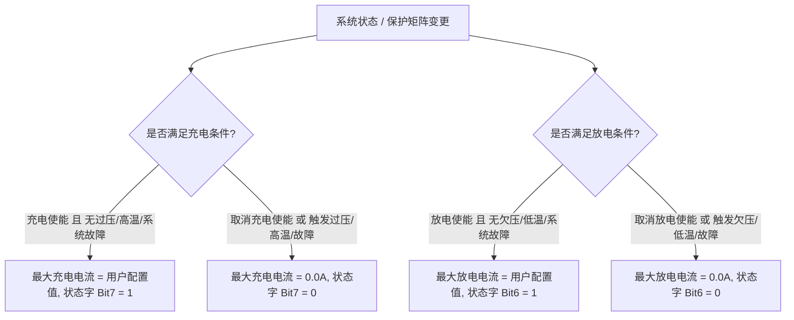

# BMS 多协议仿真与测试工作台 V1.0 (使用说明书)

## 一、 软件概述

**BMS Protocol Simulator** 是专为储能逆变器研发与自动化测试部门打造的单文件便携式测试上位机。无需安装任何 Python 环境或第三方依赖库，双击即可在 Windows 7 / 10 / 11 操作系统上原生稳定运行。

### 核心特性
1. **四大主流协议原生支持**：
   - **CVTE (Modbus RTU)**：支持读取 12 个保持寄存器（`0x0020` ~ `0x002B`），与 3KU / 5KU / VMH 逆变器底层 BMS 驱动 100% 精确对齐。
   - **GROWATT (Modbus RTU)**：支持 15 个寄存器（`0x0014` ~ `0x0022`）。
   - **VOLTRONIC (Modbus RTU)**：支持三阶段状态机轮询（`0x0030`, `0x0060`, `0x0070`）。
   - **PYLONTECH (RS485 ASCII)**：完整支持官方 Pylon low voltage RS485 规范：
     - 系统级指令：`60H` (系统基本信息)、`61H` (26项系统模拟量/总压/总流/SOC/SOH/单芯/开尔文温度)、`62H` (系统告警与保护状态字)、`63H` (充放电控制/CV/截止电压/最大充放电限流/使能状态字)、`64H` (系统关机)。
     - 单包/模块级指令：`42H`、`44H`、`47H`、`4FH`、`51H`、`92H`、`93H`、`96H`。
     - 推荐波特率：`115200` 或 `9600`。
2. **双工作模式**：
   - **从机模拟模式 (测逆变器)**：模拟电池包实时响应逆变器的轮询请求，支持全 ID（01~15）秒级极速响应。
   - **主机轮询模式 (测电池包)**：上位机作为 Modbus 主机，主动按周期向真实电池包发送查询指令并解析实时回包。
3. **三级安全确认与防误触回滚机制**：
   - 绿色闪烁：正常参数提交生效；
   - 黄色闪烁：极限工况警示提示（如极大电流、极端温度、过低/过高 SOC）；
   - 红色闪烁：非法参数（如剩余容量大于满充容量、电压<=0 等）拒绝并自动回滚。
4. **充放电使能与最大电流强联动机制**：
   - 软硬件连锁停充，取消使能或跳闸保护时自动将最大电流归零，确保逆变器可靠停充停放。
5. **自定义默认值持久化配置 (⚙)**：
   - 支持自定义 10 项参数默认基准，写入本地 `bms_default_config.ini` 文件，支持保存前合法性范围校验。

---

## 二、 硬件接线指南

### 1. 逆变器 BMS 口 (RJ45 网口) 典型线序
* **Pin 1**: RS485-B (D-) 或 RS485-A（视逆变器具体型号而定）
* **Pin 2**: RS485-A (D+) 或 RS485-B
* **Pin 3 / Pin 6 / Pin 8**: GND (地线)

### 2. 接线步骤
1. 将 USB 转 RS-485 转换器的 **A (D+)** 连接至逆变器 BMS 网口的 **RS485-A**。
2. 将 USB 转 RS-485 转换器的 **B (D-)** 连接至逆变器 BMS 网口的 **RS485-B**。
3. （强烈推荐）连接 GND 地线以消除共模电平干扰。

---

## 三、 参数范围与合理性校验规则说明

在主界面与默认参数配置窗口（⚙）中，各参数均受以下校验规则约束：

| 参数名称 | 物理单位 | 界面调节范围 | 默认基准值 | 校验与极限工况规则 |
| :--- | :---: | :---: | :---: | :--- |
| **电池总电压** | V | $0.00 \sim 100.00$ | 28.00 | 必须 $> 0\text{ V}$；精度 0.01V，步长 0.1V |
| **充放电流** | A | $-300.00 \sim +300.00$ | 0.00 | 正数为充电，负数为放电；$\|I\| \ge 200\text{ A}$ 提示重载大电流 |
| **电池 SOC** | % | $0.0 \sim 100.0$ | 100.0 | $\le 5\%$ 或 $\ge 99\%$ 触发极限 SOC 黄色提示 |
| **健康度 SOH** | % | $0 \sim 100$ | 100 | 整数百分比，必须在 $0 \sim 100$ 之间 |
| **最高温度** | °C | $-40.0 \sim 120.0$ | 28.0 | $\le -15\text{ °C}$ 或 $\ge 65\text{ °C}$ 提示极端高低温区 |
| **CV 恒压点** | V | $0.00 \sim 100.00$ | 28.80 | 必须 $> 10\text{ V}$；低于当前电池电压时触发黄色警示 |
| **剩余容量** | Ah | $0.0 \sim 2000.0$ | 100.0 | **跨参数校验**：不得大于当前满充总容量（超限拒绝并回滚） |
| **满充容量** | Ah | $0.1 \sim 2000.0$ | 100.0 | **跨参数校验**：必须 $> 0\text{ Ah}$，且不得小于当前剩余容量 |
| **最大充电电流** | A | $0.0 \sim 500.0$ | 100.0 | 与【充电使能】及过压/高温/故障保护强联动（禁充时强制 0A） |
| **最大放电电流** | A | $0.0 \sim 500.0$ | 100.0 | 与【放电使能】及欠压/低温/故障保护强联动（禁放时强制 0A） |

---

## 四、 充放电使能与保护连锁控制逻辑

为确保仿真器与各类逆变器（无论是解析状态字还是仅依据最大允许电流）协同工作的绝对安全性，系统内置了标准的储能 BMS 连锁逻辑：

### 1. 充电使能与保护联动（禁充机制）
- **触发条件**：
  - 取消勾选【充电使能】；或
  - 勾选【总压/单体过压保护】、【电芯过温保护】、【BMS系统故障】。
- **系统动作**：
  1. 主界面【最大充电电流 (A)】输入框立即自动更新并锁定为 **`0.0A`**；
  2. 缓存用户此前配置的有效电流值（如 100.0A）；
  3. 通信底层（Pylontech 63H、CVTE 0x0029、Growatt 0x0019、Voltronic 0x0070）输出的最大充电电流字段强制归零（`0A`）；
  4. 逆变器检测到 `MaxChargeCurrent <= 0` 后立即关断市电充电（`ChargeEnable = 0`）与光伏充电（`PvChargeEnable = false`）。
- **恢复条件**：重新勾选【充电使能】且上述保护全部解除时，【最大充电电流 (A)】自动恢复为用户之前的记忆值。

### 2. 放电使能与保护联动（禁放机制）
- **触发条件**：
  - 取消勾选【放电使能】；或
  - 勾选【总压/单体欠压保护】、【电芯低温保护】、【BMS系统故障】。
- **系统动作**：
  1. 主界面【最大放电电流 (A)】输入框自动更新为 **`0.0A`**；
  2. 通信底层最大放电电流强制归零（`0A`）；
  3. 重新勾选且保护解除后，自动恢复之前的设定电流。

### 3. 反向智能激活
- 当处于禁充（或禁放）状态时，若用户在模拟量面板直接输入大于 `0A` 的最大充电（或放电）电流并提交，上位机将**自动反向激活并勾选【充电使能】（或【放电使能】）**，减少频繁切换面板的操作步骤。

---

## 五、 操作使用指南

### 1. 建立通信连接
1. 打开 `BMS_Protocol_Simulator.exe`；
2. 选择正确的 COM 端口与波特率（Pylontech 推荐 115200/9600，CVTE/Growatt/Voltronic 默认 9600）；
3. 在“BMS协议”下拉框中选择待测逆变器匹配的协议；
4. 点击 **`打开串口`**，连接成功后左上角状态指示灯亮起绿色 `● 运行中`。

### 2. 参数修改与提交生效
- **修改参数**：双击或点击数值框输入新数值；
- **确认提交**：按下键盘 **`Enter`** 键或快捷键 **`Ctrl+S`** 提交生效；
- **放弃修改**：按 **`Esc`** 键或直接鼠标点击空白区域，数值立即回滚为修改前数值。

### 3. 默认值配置窗口（⚙）
1. 点击主界面模拟量下方的 **`⚙`** 按钮打开默认参数配置窗口；
2. 对话框采用严格的 5 行等距对齐排版，在此修改各参数的开机初始默认值；
3. 点击“保存为默认值”时，程序会自动校验所有参数范围；校验通过后持久化保存至 `bms_default_config.ini`，下次启动软件自动加载。
4. 在主界面随时点击 **`恢复默认`** 可一键将所有参数重置为配置文件中的默认基准值。

### 4. 实时报文监视与导出
- **报文过滤与高亮**：
  - 正常轮询与应答报文显示为常规灰色/白色；
  - 触发报警或保护状态时，报文摘要会自动高亮为红色或橙黄色；
- **视口保持与防闪烁**：
  - 监视器支持双向视口位置锁定，拖动水平/垂直滚动条查阅长报文时，界面刷新不会被强制弹回最左侧；
- **日志清空与导出**：
  - 点击 **`清空`** 可清空日志并重置收发统计计数器；
  - 点击 **`导出日志`** 可将当前通信报文完整导出为文本文件（`.txt`）。
